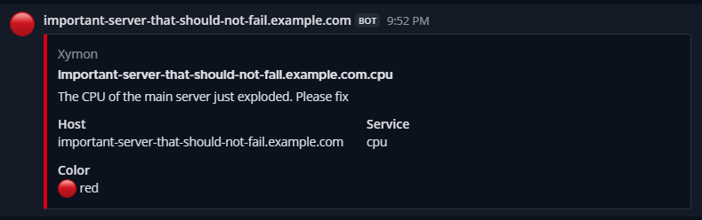
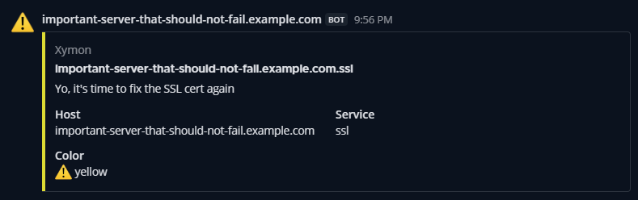
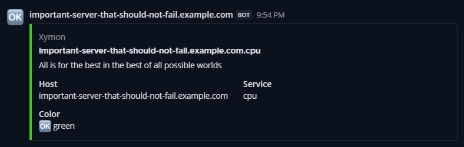

# Xymon Alerts Mattermost

## Introduction
This is a simple shell script to forward alerts from Xymon to a Mattermost instance.

This is how they look like in their target channel:

## Installation

Copy the script somewhere on your server and make it executable by xymon.

    cp /somewhere/xymon-alerts-mattermost.sh /usr/local/www/xymon/server/ext/xymon-alerts-mattermost.sh
    chown root:xymon /usr/local/www/xymon/server/ext/xymon-alerts-mattermost.sh
    chmod 750 /usr/local/www/xymon/server/ext/xymon-alerts-mattermost.sh

## Configuration

Create an incoming webhook following the documentation at https://developers.mattermost.com/integrate/webhooks/incoming/.

Edit the script and configure the URL to the webhook at the top of the file:

     url="https://mattermost.example.com/hooks/aBLMnShxzEdwzqHGnUCuuRDcgUhuqr"

Configure your Xymon alerts as usual following the documentation at https://xymon.sourceforge.io/xymon/help/xymon-alerts.html:

    HOST=important-server-that-should-not-fail.example.com
        SCRIPT /usr/local/www/xymon/server/ext/xymon-alerts-mattermost.sh xymon-alerts

The recipient is the name of the target channel.
